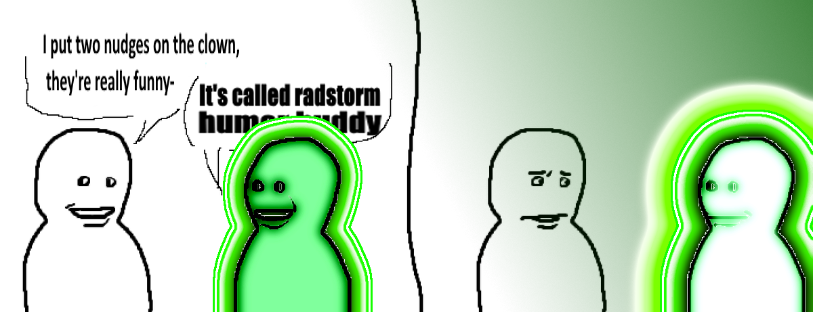

# Stagehands

{{#template ../../templates/partially-implemented.md issue=https://github.com/EphemeralSpace/ephemeral-space/issues/70}}

Stagehands are an OOC role that players can take after they die.
They take the place of the conventional observer/ghost, though they share a lot of the same properties.
Stagehands are able to invisibly observe the show, flying around the station and watching events unfold.
Additionally, they're given strong metaknowledge tools like players' masks and objectives, which help them follow along with peoples' motivations.

However, players do not automatically become stagehands upon death.
Instead, they are first returned to the [lobby](lobby-readying-up.md), where they can then choose to opt into playing as a stagehand, which locks them into that role for the remainder of the round.

This solves a very common problem with observer gameplay in most servers: **metaknowledge**.
Hidden knowledge can be shown to stagehands without introducing metaknowledge into play, since stagehands are unable to return to the round in any way.
As such, players are better able to follow the personal stories of others while mitigating the risk of introducing potentially harmful knowledge into the round.

Stagehands also create a way to keep people involved with the round without resorting to options like ghost roles.
For a ghost role, their impact on the round must necessarily be inversely proportional to their frequency, as to not allow them to overrun the action of the round.
With stagehands, however, since each player only has a small part in these high-impact decisions, many more players are able to participate than they would otherwise.

## Voting

Stagehands are collectively able to influence the round through votes which are run regularly through the round.
These votes can impact various portions of the game, with stagehands given the option to influence what happens during the round.

This in effect creates a sort of "organic game director," where instead of leaving choices up to random chance or algorithms, real people can be given the chance to make those decisions.
These observers, by virtue of being equal parts spectators and participants in the game with stakes and desires, are likely to choose options which create some sort of interesting outcome (though they may need to be 'adjusted' slightly).

Additionally, it creates a situation where, even though stagehands are not part of the physical round, they are still capable of having an impact on things as a group.
Stagehands can freely talk with each other and coordinate votes to create interesting decisions, which helps lessen the feeling of being "excluded" from the round after death.

## Stagehand Emotes

Emotes are actions made available to stagehands which play a matching audio sample to the stagehands and have a chance for living people in the area to hear.

Deadchat is often filled with people complaining about someones actions, rightfully or not.
This allows a way to vent some frustration more effectively than just yelling to other stagehands, as it is actually directed towards the offending player.

It also allows living players to recieve feedback on their play; a syndie who just completed an objective may get a round of applause, with obvious benefits.

## Nudges {.es-unimplemented}

Nudges are used by stagehands to influence specific players in round with status effects or other small boons.
A nudge can be positive or negative, but opposing nudges nullify eachother, i.e. 4 positive nudges and 6 negative would come out to be 2 negative.
Once a nudge is applied to a player, it can only be retrieved once they complete an objective or die.
Each stagehand has a small amount of nudges depending on how many of their objectives they have completed in their time in the spotlight.

This continues the concept of an organic game director on a lower level; the stagehands compete for their favourite individuals, whereas votes act as an influence over the station as a whole.
For example, it allows a natural underdog bonus, as a troupe that has killed a large number of people will have many enemies beyond the curtains.

The passive nature of the effects mean the player can still go up against all odds, or fail dramatically even with the backing of every single audience member.

The nullifying effect of nudges are the main balancing factor.
A character that attracts a large amount of nudges in one direction will likely draw in opposing nudges as well.
Allowing the stagehands to see the total and effective number of nudges on characters naturally invites this behaviour.

### Radstorm Nudges {.es-unimplemented}

Stagehands can use nudges to shift the radstorm closer.
It has no effect unless a proportion of the stagehands nudge for it, to prevent abuse.
This allows a round that has petered out due to decay and/or all the troupes failing to complete their objectives end at a good pace.

