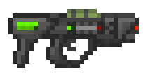
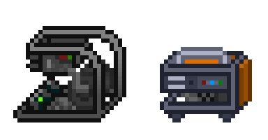
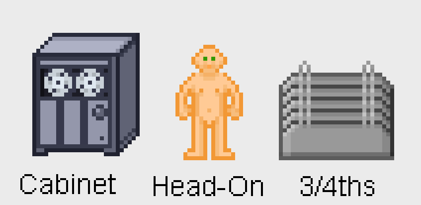
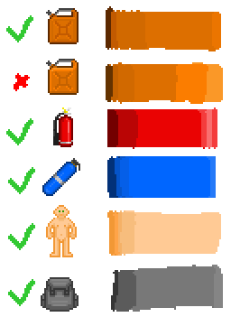
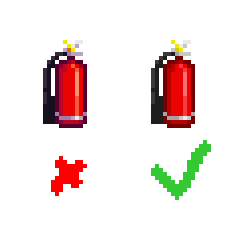

# Spriting Guidelines
```admonish warning "Disclaimer"
These are not hard-and-fast rules to force yourself to abide by, they are guidelines to help you understand what makes a sprite generally fit. There are (and always will be) plenty of sprites that break these rules and fit fantastically - sometimes even due in part to elements that explicitly do go against the advice mentioned here. It's impossible to encapsulate something as subjective as pixel art down to a science.
```

This guide intends to cover most of the basic elements that make up sprites in Ephemeral Space - and by extension, a lot of specific knowledge accumulated over the years relating to the classic artstyle.
Of course, this is not a guide for *that,* as ES makes a lot of intentional deviances, but it should help inform

## Art Style

### Simplicity
Don't overcomplicate your designs or be afraid to exaggerate certain things to help with readability or emphasis. Space Station is retro-futuristic and silly, and your designs should reflect that.

The good example of this principle in action is probably the energy gun, which is comically campy and extremely non-tactical looking, with an obvious charge meter and place for the lasers to go through. This gives the gun a kind of goofy, simplistic quality that re-affirms the setting and their intended use case (as a utilitarian gun on a space station with no "real" professional gun-users available.)



## Readability
It should be easy to tell what an item actually is at a glance; realism and spatial consistency are secondary to this (unless it is distracting.)
Small items (like the pen or cigarette pack) appear bigger then they actually would be relative to other things. Obviously, a cigarette pack is not 1/4th the size of a crowbar - but we waive it away in our heads anyway, and it makes the item a lot easier to notice as that specific item.

Inhands are also a notable example of this principle: they're often notably spatially inconsistent, and certain items don't make any sense to be as big as they are (EVA suits being as big as a helmet comes to mind.)
This is a feature and not a bug, however - not only does it save time making extremely annoying sprites, but it also ensures the item is easily parsable at all times.

Also see Contrast for more information on this, technique-side.

### Retro-Futurism
It's the future, but old! There are CRT terminals everywhere, the armory still uses regular earthly shotguns with wooden stocks, and instead of a smartphone or whatever, everyone carries around PDAs.

This lends the game a "grounded" feel despite being unquestionably set in the future, and helps as an element of contrast against the things that *are* more tech-y and advanced when they show up.

It doesn't hurt if they have a sci-fi flair, but objects should generally reference their real-world counterparts. It helps with player understanding of the object and further reinforces the grounded element of the setting.



### Perspective
There are 3 common types of perspective projections used in Ephemeral Space: Cabinet, Head-On, and 3/4ths.



- Mobs, items, walls, and wallmounts are generally rendered in a head-on projection.
- Structures & storage containers are generally rendered in cabinet projection.
- Sometimes, 3/4ths is used if an object needs to convey directionality or sense of depth.

Head-on is great for readability and simplistic to sprite in, making it a no-brainer for most items and mobs, as it conveys exactly what is needed - especially in mobs's case, where they are often 4-directional, and don't need the added side-face detail from cabinet. In the case of wall-like structures, while hard to sprite in, it helps with wallmount visibility.
Cabinet projection is also usually great for readability & conveying what an object looks like while imposing less spritework, which is why it is used on 1-directional structures & storage containers.
3/4ths generally squashes detail and makes items harder to read, but conveys a better sense of depth, making it good for things like tables or directional structures.

More importantly to emphasize then usual: there are blatant exceptions to this, and this is not a commandment.
Your main takeaway from this should be to just use whatever perspective suits the situation best. Consistency is important to making a belivable and good-looking game world, but readability and things looking good is *more* important. Nobody would benefit if every hat was in a head-on perspective to be consistent with other items, or if the medibot was in head-on perspective to make it consistent with the other mobs.
It's not only unrealistic to force everything in to the same perspective, it's actively *bad* for the game's visual cohesion & quality.

## Technique

### Contrast
Sprites should be easily visible in the situations they are in commonly ingame. If it doesn't composite well in those situations, (i.e an object is hard to see on steel tiles,) this is a problem that should be rectified.

Above all else, you should remember that you are making sprites for a video game, and that things don't exist in a vaccuum. It's possible to have a great-looking sprite in isolation that looks bad ingame.
This is a pillar that is especially imperative to maintain for Space Station, where the top-down perspective, imsim-y nature, and low resolution means that item clutter is extremely common and unavoidable.

### Outlines
Objects should have strong, contrasting outlines that correspond to its color. This significantly helps with item readability and is part of what gives the game its cartoony look.

### Shading
Most objects have little-to-no highlight color usage - or, at minimum, strong highlight bands with little transitioning done in to them. Large amounts of the primary shade should be used to convey brightness instead, with highlights being added for emphasis for an object's shape, or shiny areas on an object.

In other words - most objects should not have an "even" shading ramp. The majority of the ramp should be taken up by the base shade.



Additionally, the luster of the and texture of the material are important to consider. Cloth might have folds in it, rubber might be excessively shiny, cardboard might be largely flat, etc.

### Palette Size
Each color in your palette should have a purpose; using noise or things like the burn tool can make sprites hard to edit after the fact, and will typically make them look a good bit worse. Hard-to-percieve colors are still fine as long as they serve a purpose.

### Color Usage
Hue-shifting and saturation shifting are generally useful techniques to use to enrich the darker and brighter tones in your sprites. Colored objects without them often look dull.

While useful, you should **use it in accordance to your needs** and avoid over-using it, as it can lead to objects looking fantastical, over-saturated, and drown out the object's original color.



Shadows and highlights in an object should also be temperature-neutral, since the ambient light on the station can often vary.
